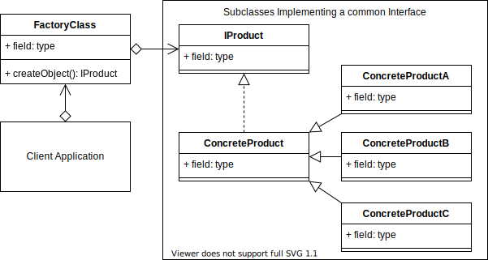
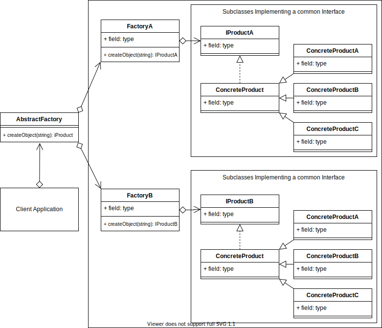

# Factory pattern
This pattern is about creating an abstraction between the creation of an object and where it is used in the  project.
This extra abstraction also means that the complications of instantiating extra objects can now be hidden from the class or method that is using it.

Example: Imagine that you have a "House" class and it comes with a chair by default in the ground. With the Factory pattern you could give the option to the user to change this chair and how many you want at runtime.

Terminology: 
- Concrete Creator: The client application, class or method that calls the Creator (Factory method).
- Product Interface: The interface describing the attributes and methods that the factory will require in order to create the final product/object.
- Creator: The Factory class. Declares the Factory method that will return the object requested from it.
- Concrete Product: The object returned from the factory. The object implements the Product interface.



## First code example:
Here the client wants an object named `b`. Instead of creating it directly it asks for the **creator** for the object. The creator understands what the client wants through calling arguments and it returns the desired object.

```typescript
// The Factory Concept

interface IProduct {
    name: string
}

class ConcreteProduct implements IProduct {
    name = ''
}

class ConcreteProductA extends ConcreteProduct {
    constructor() {
        super()
        this.name = 'ConcreteProductA'
    }
}

class ConcreteProductB extends ConcreteProduct {
    constructor() {
        super()
        this.name = 'ConcreteProductB'
    }
}

class ConcreteProductC extends ConcreteProduct {
    constructor() {
        super()
        this.name = 'ConcreteProductC'
    }
}

class Creator {
    static createObject(someProperty: string): IProduct {
        if (someProperty === 'a') {
            return new ConcreteProductA()
        } else if (someProperty === 'b') {
            return new ConcreteProductB()
        } else {
            return new ConcreteProductC()
        }
    }
}

// The Client
const PRODUCT = Creator.createObject('b')
console.log(PRODUCT.name)
```

This brings great improvements in code readability. It promotes the usage of a class that implements a given template and is extended by other classes. Then the factory can provide a cleaner way of dealing with these subclasses.

So:
- The Factory pattern is about inserting an abstraction between the instantiation of the object and where it is used.
- It is unknown how many objects you will need to create until runtime.
- The creator implements the instantiating details so that the client doesn't need to deal with such complexities.


# Abstract Factory pattern
The abstract factory adds another abstraction layer over multiple other factory pattern implementations. Its a factory that returns factories.

Terminology:
- Client: The caller of the abstract factory.
- Abstract Factory: A common interface over all the sub factories.
- Concrete Factory: The factory that has the methods for creating the concrete product.
- Abstract Product: The interface and/or abstraction for the product that the sub factory returns.
- Concrete Product: The object that is finally returned.



Example:

```typescript
// abstract-factory-concept.ts

// Abstract Factory Concept Sample Code
import { FactoryA, IProductA } from './factory-a'
import { FactoryB, IProductB } from './factory-b'

interface IProduct extends IProductA, IProductB {}

class AbstractFactory {
    // The Abstract Factory Concrete Class

    static createObject(factory: string): IProduct | undefined {
        try {
            if (['aa', 'ab', 'ac'].indexOf(factory) > -1) {
                return FactoryA.getObject(factory[1])
            }
            if (['ba', 'bb', 'bc'].indexOf(factory) > -1) {
                return FactoryB.getObject(factory[1])
            }
            throw new Error('No Factory Found')
        } catch (e) {
            console.log(e)
        }  
    }
}

// The Client
let PRODUCT = AbstractFactory.createObject('ab')
console.log(PRODUCT)

PRODUCT = AbstractFactory.createObject('bc')
console.log(PRODUCT)
```

```typescript
// factory-a.ts

// FactoryA Sample Code

export interface IProductA {
    name: string
}

class ConcreteProduct implements IProductA {
    name = ''
}

class ConcreteProductA extends ConcreteProduct {
    constructor() {
        super()
        this.name = 'FactoryA:ConcreteProductA'
    }
}

class ConcreteProductB extends ConcreteProduct {
    constructor() {
        super()
        this.name = 'FactoryA:ConcreteProductB'
    }
}

class ConcreteProductC extends ConcreteProduct {
    constructor() {
        super()
        this.name = 'FactoryA:ConcreteProductC'
    }
}

export class FactoryA {
    static getObject(some_property: string): IProductA {
        try {
            if (some_property === 'a') {
                return new ConcreteProductA()
            } else if (some_property === 'b') {
                return new ConcreteProductB()
            } else if (some_property === 'c') {
                return new ConcreteProductC()
            } else {
                throw new Error('Class Not Found')
            }
        } catch (e) {
            console.log(e)
        }
        return new ConcreteProduct()
    }
}
```

```typescript
// factory-b.ts

// FactoryB Sample Code

export interface IProductB {
    name: string
}

class ConcreteProduct implements IProductB {
    name = ''
}

class ConcreteProductA extends ConcreteProduct {
    constructor() {
        super()
        this.name = 'FactoryB:ConcreteProductA'
    }
}

class ConcreteProductB extends ConcreteProduct {
    constructor() {
        super()
        this.name = 'FactoryB:ConcreteProductB'
    }
}

class ConcreteProductC extends ConcreteProduct {
    constructor() {
        super()
        this.name = 'FactoryB:ConcreteProductC'
    }
}

export class FactoryB {
    static getObject(some_property: string): IProductB {
        try {
            if (some_property === 'a') {
                return new ConcreteProductA()
            } else if (some_property === 'b') {
                return new ConcreteProductB()
            } else if (some_property === 'c') {
                return new ConcreteProductC()
            } else {
                throw new Error('Class Not Found')
            }
        } catch (e) {
            console.log(e)
        }
        return new ConcreteProduct()
    }
}
```

so:
- Use when you want to provide a library of relative similar products from different factories.
- You want the system to be independent of how the products are created.
- The client only needs to implement the interface and not the complexities that come with the implementation of the factory.
- You want to enforce consistent interfaces across products.
- You want the possibility to exchange product families.
- It provides flexibility.
