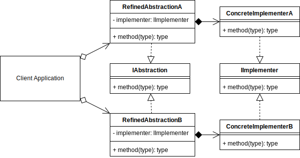

# Bridge Pattern
It's similar to the Adapter except in the intent that you developed it.

The Bridge is an approach to refactor already existing code, whereas the Adapter creates an interface on top of existing code through existing available means without refactoring any existing code or interfaces.

The motivation for converting your code to the Bridge pattern is that it may be tightly coupled. There is logic and abstraction close together that is limiting your choices in how you can extend your solution in the way that you need.

Example: You have a car class, but you need the engine to be delegated to other classes, so you take the engine off.

The Bridge pattern is a process about separating abstraction and implementation, so this will allow you more ways of using your classes.

A bridge didn't exist before, but since after the separation of interface and logic, each side can be extended independently of each other.



```typescript
// Bridge Pattern Concept Sample Code

interface IAbstraction {
    method(value: string[]): void
}

class RefinedAbstractionA implements IAbstraction {
    #implementer: IImplementer

    constructor(implementer: IImplementer) {
        this.#implementer = implementer
    }

    method(value: string[]) {
        this.#implementer.method(value)
    }
}

class RefinedAbstractionB implements IAbstraction {
    #implementer: IImplementer

    constructor(implementer: IImplementer) {
        this.#implementer = implementer
    }

    method(value: string[]) {
        this.#implementer.method(value)
    }
}

interface IImplementer {
    method(value: string[]): void
}

class ConcreteImplementerA implements IImplementer {
    method(value: string[]) {
        console.log(value)
    }
}

class ConcreteImplementerB implements IImplementer {
    method(value: string[]) {
        value.forEach((v) => console.log(v))
    }
}

// The Client
const VALUES = ['a', 'b', 'c']

const REFINED_ABSTRACTION_A = new RefinedAbstractionA(
    new ConcreteImplementerA()
)
REFINED_ABSTRACTION_A.method(VALUES)

const REFINED_ABSTRACTION_B = new RefinedAbstractionB(
    new ConcreteImplementerB()
)
REFINED_ABSTRACTION_B.method(VALUES)
```

So:
- Use when you want to separate a solution where the abstraction and implementation may be tightly coupled and you want to break it up into smaller conceptual parts.
- Once you have added the bridge abstraction, you should be able to extend each side of it separately without breaking the other.
- Also, once the bridge abstraction exists, you can more easily create extra concrete implementations for other similar products that may also happen to be split across similar conceptual lines.
- The Bridge pattern is similar to the adapter pattern except in the intent that you developed it. The bridge is an approach to refactor already existing code, whereas the adapter adapts to the existing code through its existing interfaces and methods without changing the internals.
